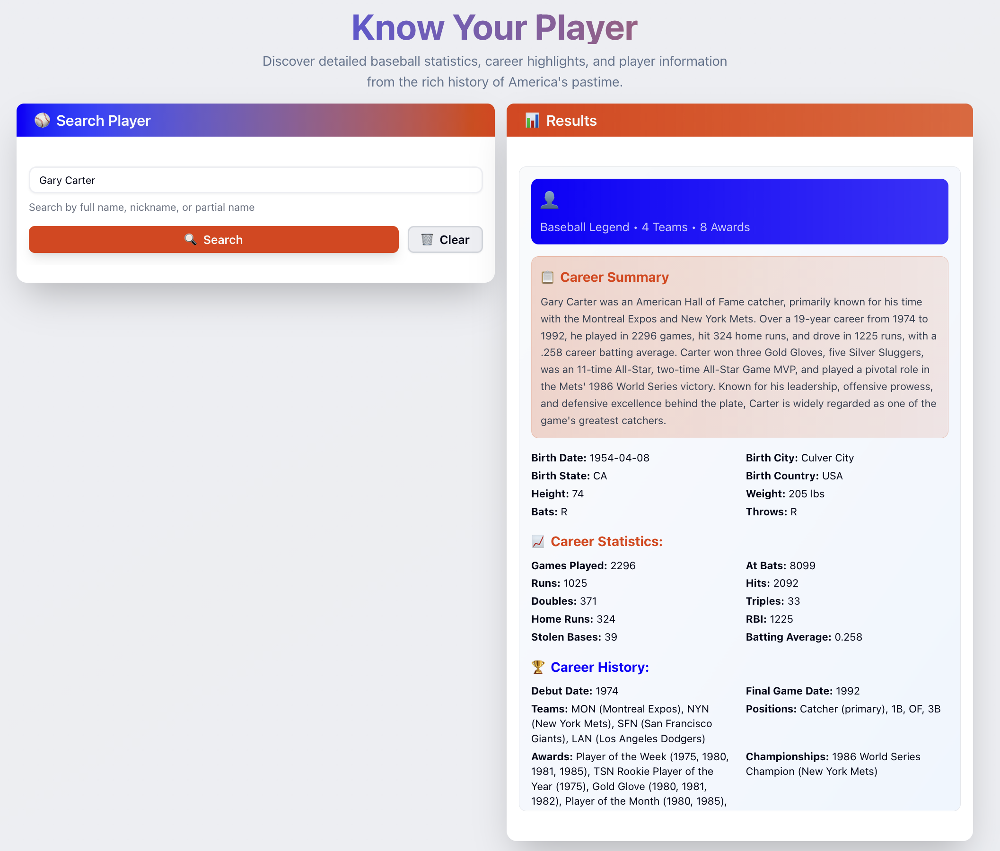

# Know Your Player - Baseball Information System

A complete full-stack application for querying comprehensive baseball player information using AI agents. The system consists of a Next.js frontend and FastAPI backend that leverages OpenAI Agents SDK with Supabase database integration.



## 🏗️ Architecture

```mermaid
┌─────────────────┐    HTTP/SSE    ┌─────────────────┐
│                 │ ──────────────► │                 │
│  Next.js        │                │  FastAPI        │
│  Frontend       │ ◄────────────── │  Backend        │
│                 │    JSON/Stream  │                 │
└─────────────────┘                └─────────────────┘
         │                                   │
         │                                   │
         ▼                                   ▼
┌─────────────────┐                ┌─────────────────┐
│                 │                │                 │
│  Tailwind CSS   │                │  OpenAI Agents  │
│  TypeScript     │                │  SDK            │
│  React 19       │                │                 │
└─────────────────┘                └─────────────────┘
                                             │
                                             │
                                             ▼
                                   ┌─────────────────┐
                                   │                 │
                                   │  Supabase DB    │
                                   │  Web Search     │
                                   │                 │
                                   └─────────────────┘
```

## 📋 Prerequisites

Before running the project, ensure you have the following installed:

- **Python 3.12+** with [UV package manager](https://docs.astral.sh/uv/)
- **Node.js 18+** with npm
- **Git** for version control

## 🚀 Quick Start

### 1. Clone and Navigate

```bash
git clone <repository-url>
cd workshop-03-project-share
```

### 2. Environment Setup

Create environment files with the required API keys:

#### Backend Environment (.env in baseball_backend/)

```bash
cd baseball_backend
cat > .env << EOF
# Required: Supabase Configuration
SUPABASE_ACCESS_TOKEN=your_supabase_access_token_here
SUPABASE_PROJECT_REF=your_supabase_project_reference_here

# Optional: OpenAI Configuration (if using OpenAI models)
OPENAI_API_KEY=your_openai_api_key_here
EOF
```

> **📝 Note**: Get your API keys from the [shared Bitwarden link](https://send.bitwarden.com/#uJt75EmbvEuVwbNkAQ16vw/5qFaWseq15sJ-txQGXyxgg)

### 3. Backend Setup & Start

```bash
# Install dependencies
uv install

# Start the FastAPI server
uv run uvicorn src.baseball_backend.main:app --reload
```

The backend will be available at: **http://localhost:8000**

### 4. Frontend Setup & Start

Open a new terminal window:

```bash
cd baseball_frontend

# Install dependencies
npm install

# Start the development server
npm run dev
```

The frontend will be available at: **http://localhost:3000**

## 🎯 Usage

1. **Open your browser** to [http://localhost:3000](http://localhost:3000)
2. **Enter a player name** (e.g., "Babe Ruth", "Gary Carter", "Mike Trout")
3. **Click Search** and watch the AI gather information in real-time
4. **View comprehensive results** including:
   - Career history and highlights
   - Detailed statistics
   - Basic player information
   - Notable games

## 🔧 Development Commands

### Backend (baseball_backend/)

```bash
# Install dependencies
uv install

# Run server (development)
uv run uvicorn src.baseball_backend.main:app --reload

# Run tests
uv run pytest

# Run specific test file
uv run pytest tests/unit/test_baseball_agent.py

# Run integration tests
uv run pytest tests/integration/
```

### Frontend (baseball_frontend/)

```bash
# Install dependencies
npm install

# Development server
npm run dev

# Build for production
npm run build

# Start production server
npm start

# Linting
npm run lint

# Code formatting
npm run format
```

## 📁 Project Structure

```
workshop-03-project-share/
├── baseball_backend/          # FastAPI Backend
│   ├── src/baseball_backend/
│   │   ├── agents/           # AI agent implementations
│   │   ├── api/endpoints/    # API route handlers
│   │   ├── models/           # Pydantic models
│   │   ├── prompts/          # AI system prompts
│   │   └── main.py          # FastAPI application
│   ├── tests/               # Backend tests
│   └── pyproject.toml       # Python dependencies
├── baseball_frontend/        # Next.js Frontend
│   ├── src/
│   │   ├── app/             # Next.js App Router pages
│   │   ├── components/      # React components
│   │   └── types/           # TypeScript definitions
│   └── package.json         # Node.js dependencies
├── specs/                   # Project specifications
└── workshop/               # Workshop materials
```

## 🛠️ Technology Stack

### Frontend

- **Framework**: Next.js 15 with App Router
- **Language**: TypeScript 5
- **Styling**: Tailwind CSS 4
- **State Management**: React 19 hooks
- **Linting**: Biome

### Backend

- **Framework**: FastAPI
- **Language**: Python 3.12
- **AI**: OpenAI Agents SDK
- **Database**: Supabase with MCP integration
- **Package Manager**: UV
- **Testing**: Pytest

## 🔍 API Endpoints

### GET /query

Query for comprehensive baseball player information.

**Parameters:**

- `player_full_name` (query param): Full name of the baseball player

**Example:**

```bash
curl "http://localhost:8000/query?player_full_name=Babe Ruth"
```

**Response:**
Streaming response with real-time updates, concluding with JSON containing:

- `history`: Career narrative
- `simple_information`: Basic player facts
- `statistics`: Performance metrics
- `games`: Recent notable games

## 🧪 Testing

### Backend Tests

```bash
cd baseball_backend

# Run all tests
uv run pytest

# Run with coverage
uv run pytest --cov=src/baseball_backend

# Run specific test categories
uv run pytest tests/unit/        # Unit tests
uv run pytest tests/integration/ # Integration tests
```

### Frontend Testing

The frontend uses built-in Next.js development tools for type checking and linting.

## 🚨 Troubleshooting

### Common Issues

**Backend not starting:**

- Ensure Python 3.12+ is installed
- Check that UV is properly installed: `uv --version`
- Verify environment variables are set in `.env` file

**Frontend not connecting to backend:**

- Ensure backend is running on port 8000
- Check CORS configuration in FastAPI
- Verify no firewall is blocking localhost connections

**API errors:**

- Verify Supabase credentials are correct
- Check OpenAI API key if using OpenAI models
- Review backend logs for detailed error messages

### Logs and Debugging

**Backend logs**: Check terminal output where uvicorn is running
**Frontend logs**: Check browser developer console
**API testing**: Use the FastAPI automatic docs at http://localhost:8000/docs

## 🤝 Contributing

1. Fork the repository
2. Create a feature branch: `git checkout -b feature-name`
3. Make your changes
4. Run tests: `uv run pytest` (backend) and `npm run lint` (frontend)
5. Commit changes: `git commit -am 'Add feature'`
6. Push to branch: `git push origin feature-name`
7. Create a Pull Request

## 📄 License

This project is part of a workshop demonstration. See individual component licenses for details.

## 🎓 Workshop Information

This application was built as part of Workshop 03 using [spec-kit](https://github.com/github/spec-kit) methodology. The complete development process and specifications can be found in the `specs/` directory.

For workshop materials and additional resources, see the `workshop/` directory.
