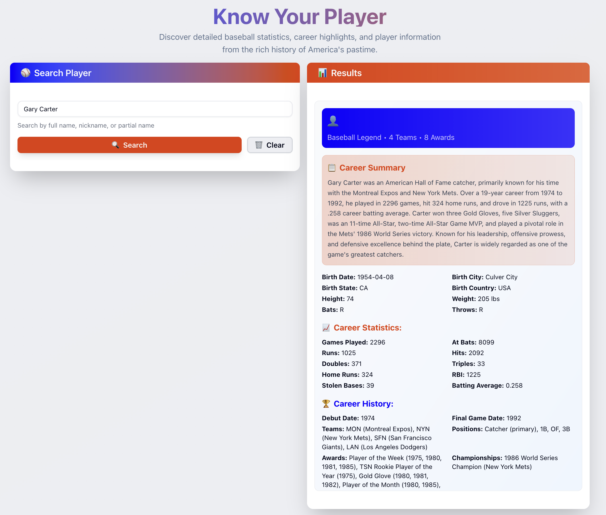

# Workshop 03 prompts

We're going to use [spec-kit](https://github.com/github/spec-kit) to create the complete application from scratch.

## What we have

1. We have initialized a bare backend project using UV python with python 3.12 support (baseball_backend)
2. We create a basic nextjs application using the create-next-app command (baseball_frontend)
3. We'll share a list of prompts to guide the development process using spec-kit
4. We'll share a few environment variables to use OpenAI and Supabase services (see https://send.bitwarden.com/#uJt75EmbvEuVwbNkAQ16vw/5qFaWseq15sJ-txQGXyxgg)

## What you'll need

1. Cursor IDE or VS Code
2. Python UV installed
3. NodeJS installed

## What you'll do

We'll implemente a complete POC application that will have two main parts: a frontend application using NextJS15 with App router and server actions, using typescript. And a backend using Python and FastAPI, that is going to deliver AI services though the OpenAI Agents SDK.

The application will ask the user to provide a baseball player name and it will use the backend to get the information about the player.



### 🏗️ Architecture

```mermaid
┌─────────────────┐    HTTP/SSE    ┌─────────────────┐
│                 │ ──────────────► │                 │
│  Next.js        │                │  FastAPI        │
│  Frontend       │ ◄────────────── │  Backend        │
│                 │    JSON/Stream  │                 │
└─────────────────┘                └─────────────────┘
         │                                   │
         │                                   │
         ▼                                   ▼
┌─────────────────┐                ┌─────────────────┐
│                 │                │                 │
│  shadcn/ui      │                │  OpenAI Agents  │
│  Tailwind CSS   │                │  SDK            │
│  TypeScript     │                │                 │
└─────────────────┘                └─────────────────┘
                                             │
                                             │
                                             ▼
                                   ┌─────────────────┐
                                   │                 │
                                   │  Supabase DB    │
                                   │  Web Search     │
                                   │                 │
                                   └─────────────────┘
```
